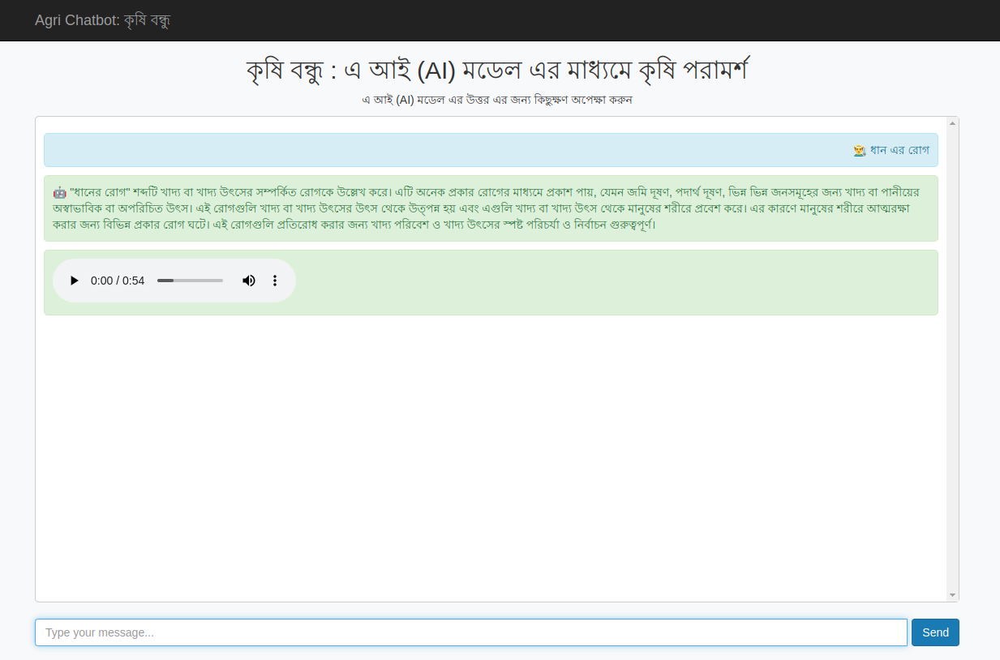

# Agri Chatbot: Chat-Bot-using-LLM-with-Gradio

This project is an agriculture chatbot designed to assist farmers with their queries using a large language model. The chatbot is built with Flask for the backend and uses a pre-trained model from Hugging Face for generating responses.

## Features

- Chat interface for interacting with the chatbot.
- Text-to-speech for the chatbot's responses.
- Responsive design using Bootstrap.

## Getting Started

### Prerequisites

- Python 3.7+
- Pip (Python package installer)
- Git (for cloning the repository)
- PyTorch

### Installation

1. **Clone the repository:**

    ```sh
    git clone https://github.com/FaisalAhmedBijoy/Chat-Bot-using-LLM-with-Gradio
    ```

2. **Install the dependencies:**

    ```sh
    pip install -r requirements.txt
    ```

3. **Download the model:**

    Download the model `Qwen/Qwen2-7B-Instruct` from Hugging Face and place it in a directory, for example, `models`.

    ```sh 
    python download_model.py
    ```


### Running the Application

1. **Run the Flask application:**

    ```sh
    python app.py
    ```

2. **Open your browser and go to:**

    ```
    http://127.0.0.1:5000
    ```

## Project Structure

```bash
agri-chatbot/
│
├── static/
│ ├── audio/
│ ├── images/
├── templates/
│ └── index.html
│
├── .env
├── app.py
├── download_model.py
├── requirements.txt
└── README.md
```


## Demo



## Usage

- Type your query in the input box and press `Send`.
- The bot will respond with a text message and an audio message.

## Acknowledgments

- The chatbot uses the [Qwen2-7B-Instruct]([text](https://huggingface.co/Qwen/Qwen2-7B-Instruct)) model from Hugging Face.
- Flask is used for the web framework.
- Bootstrap is used for styling the web interface.

## Contributors

- [Faisal Ahmed](https://www.linkedin.com/in/faisal-ahmed-2a71581b1/)
- [H.M.Mehedi Hasan (Badhon)](https://www.linkedin.com/in/h-m-mehedi-hasan-badhon/) 


